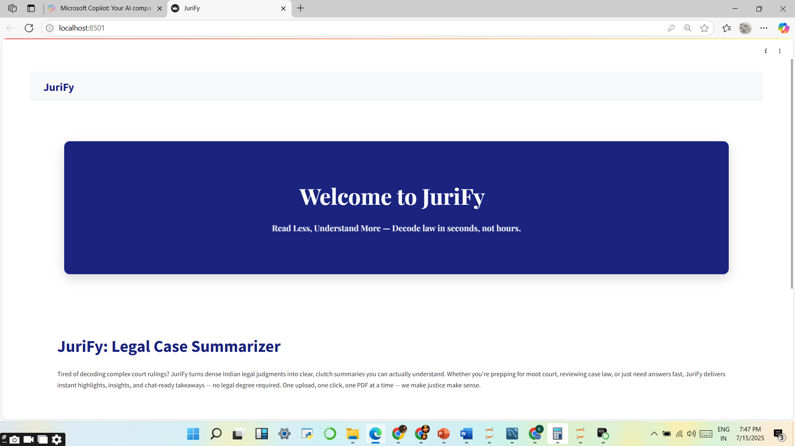
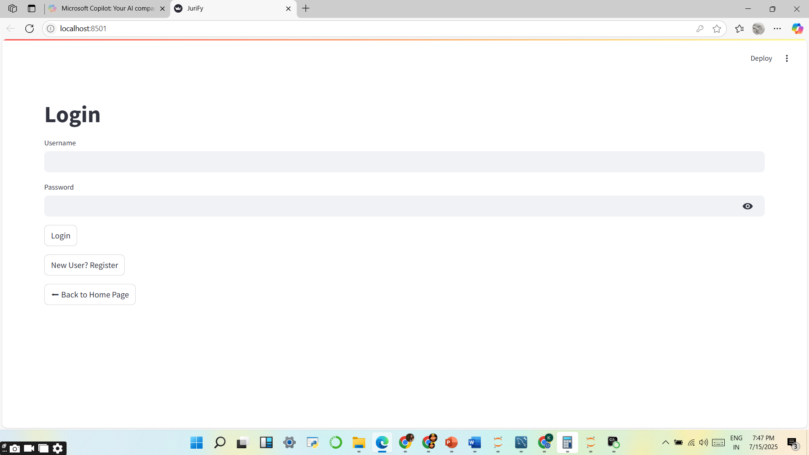
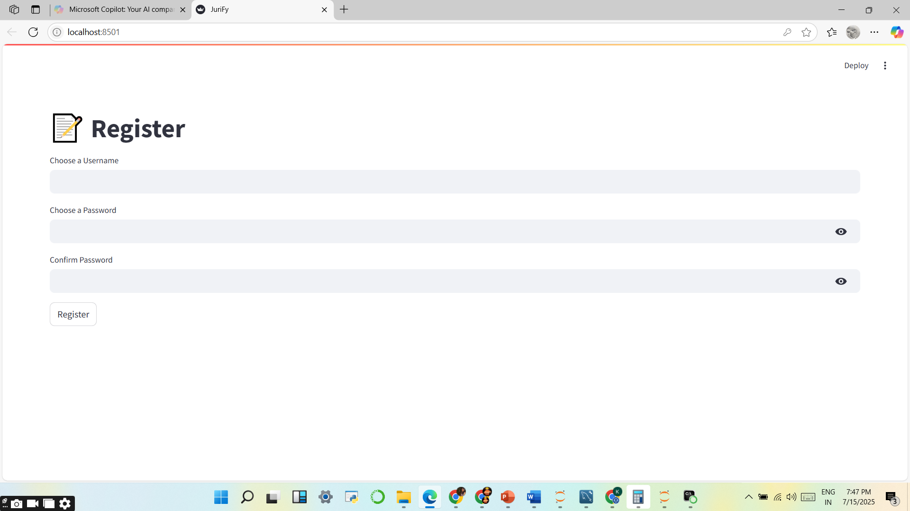
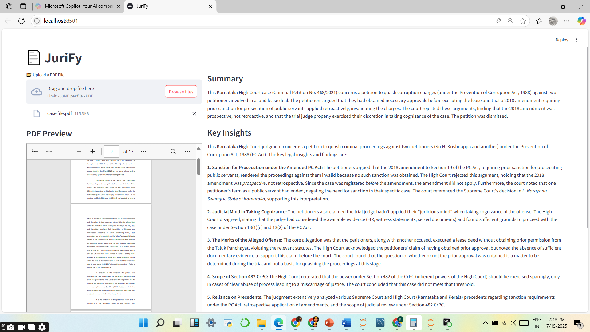
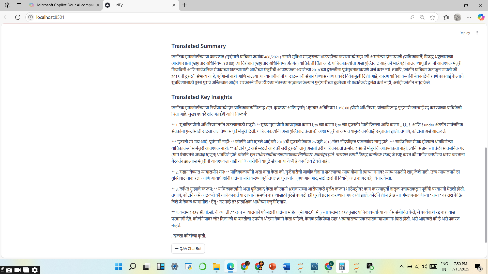
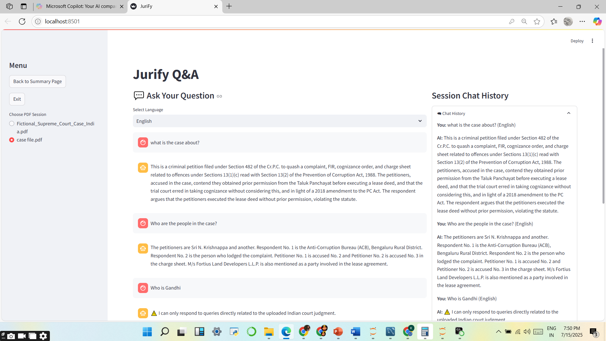

# JuriFy – AI-Powered Legal Assistant

**JuriFy** is a generative AI–powered legal assistant built with Gemini and Python that simplifies the way Indian court judgments are consumed, understood, and explored.

Instead of reading through hundreds of pages of complex legal language, users can upload a single PDF from the **Supreme Court, High Court, or District Court of India** and receive a clean, concise summary along with critical insights — all within seconds.

Designed with accessibility in mind, JuriFy enables users to:

- Instantly summarize court judgments.
- Translate legal insights into regional Indian languages.
- Ask judgment-specific legal questions via **voice or text input**.
- Get real-time answers sourced strictly from the uploaded document.
- Maintain chat history and user sessions with backend MySQL integration.

Whether you're a law student preparing for moot court, an advocate drafting briefs, or a citizen seeking clarity on a personal case, JuriFy is built to **save you hours of reading and interpretation** while delivering trustworthy, document-specific responses.

>  **Note**: JuriFy currently supports only Indian court documents and is designed to reject foreign or unrelated legal PDFs for accuracy and compliance.

---

##  Overview

### What is JuriFy?

**JuriFy** is a smart, AI-powered legal assistant that simplifies the interpretation of Indian court judgments. By combining document summarization, multilingual translation, and a judgment-specific chatbot, it transforms complex legal texts into clear, digestible content.

### The Problem It Solves

Indian court judgments are often dense, long, and filled with legal jargon — making them difficult for non-lawyers and even professionals to interpret quickly. JuriFy addresses this by:

- Summarizing lengthy judgments within seconds.
- Highlighting key legal insights and rulings.
- Supporting multilingual understanding through live translations.
- Enabling users to interactively ask questions about the case — in voice or text.

### Who It’s For

JuriFy is designed to assist:

- **Law Students** – who need fast, reliable summaries while preparing for moot courts or research.
- **Legal Researchers** – who seek quick insights into multiple judgments.
- **Advocates & Paralegals** – for brief preparation and case analysis.
- **Citizens** – who want to understand their legal documents without legal assistance.

> In short: If you're navigating Indian court documents, JuriFy makes your job easier, faster, and clearer.

---

## Features

JuriFy offers a comprehensive set of features tailored to simplify and interact with Indian court judgments:

- **Upload PDF Judgments**  
  Supports case files from the Supreme Court, High Courts, and District Courts of India.

- **AI-Powered Legal Summarization**  
  Uses Google Gemini to generate concise, judgment-specific summaries and insights.

- **Real-Time Language Translation**  
  Instantly translates summaries and insights into Indian languages such as Kannada, Hindi, Telugu, and more via the Deep Translator API.

- **Interactive Legal Q&A Chatbot**  
  Enables users to ask questions directly related to the uploaded judgment and provides accurate, document-specific answers.

- **Voice Input for Queries**  
  Allows users to speak legal questions in multiple Indian languages. The system transcribes and interprets them intelligently.

- **User Authentication System**  
  Includes secure login and registration functionality with MySQL backend support.

- **Session-Based Chat History**  
  Stores all interactions, including questions, answers, timestamps, and session details, both locally and in the MySQL database.

- **Court Document Validation**  
  Automatically verifies whether the uploaded PDF is a valid Indian court judgment and blocks unsupported files.

JuriFy combines artificial intelligence, legal understanding, and multilingual accessibility to deliver a powerful yet user-friendly legal tool.

---

## Tech Stack

JuriFy is built using a combination of modern open-source tools and APIs:

- **Streamlit**  
  Used to create an intuitive and interactive web-based user interface.

- **Gemini 1.5 Flash (Google Generative AI)**  
  Powers the AI-driven summarization and legal reasoning capabilities.

- **Deep Translator (Google Translate API)**  
  Enables real-time translation of summaries and answers into Indian languages.

- **PyMuPDF (fitz)**  
  Extracts structured text from uploaded legal PDF documents.

- **MySQL**  
  Handles user authentication, chat history storage, and session data persistence.

- **SpeechRecognition and SoundDevice**  
  Capture and transcribe voice inputs for multilingual Q&A support.

- **JSON, Hashlib, Tempfile**  
  Facilitate secure data handling, session management, and file storage operations.

---

## How to Use

Follow these steps to use JuriFy effectively:

1. **Register or Login**  
   Create a new user account or log in using your credentials to access the main features.

2. **Upload a PDF of an Indian Court Judgment**  
   Upload judgments from the Supreme Court, High Courts, or District Courts of India. Only valid Indian court documents are accepted.

3. **View Summary and Key Insights**  
   Once uploaded, JuriFy will generate a concise summary and highlight key legal insights using AI.

4. **Translate to Indian Languages**  
   Use the translation feature to convert the summary and insights into languages like Hindi, Kannada, Telugu, and more.

5. **Ask Questions via Text or Voice**  
   Use the AI chatbot to ask case-related legal questions. You can type your query or speak it using the voice input feature. Questions can be asked in multiple supported Indian languages.

6. **View Full Session History**  
   All chat interactions, questions, and answers are saved for reference. You can revisit previous sessions or download the data if needed.

---

## 🖼 UI Previews

### Home Page

### Login Page

### RegisterPage

### SummaryPage

### TranslatedSummary

### Q&APage

---

## Limitations

- The application accepts only judgments from Indian courts (Supreme Court, High Courts, District Courts).
- Voice recognition is currently limited to major Indian languages and may not accurately detect regional dialects.
- The app is not deployed publicly yet and runs only in a local environment.

---

## Future Enhancements

- Deploy the application on Streamlit Cloud, Render, or another cloud platform.
- Add a multi-user dashboard to manage sessions and analytics.
- Implement secure authentication using bcrypt and JWT for better data protection.
- Allow uploading and analyzing multiple judgments within a single session.
- Enable export of chat logs for offline reference or documentation.

---

## Contact / Credits

**Created by:** [Kshiti Anil Kumar](https://www.linkedin.com/in/kshitianilkumar/)  
**GitHub Repository:** [JuriFy](https://github.com/KshitiAnilKumar/JuriFy)

---

### Tools & Technologies Used

- **Gemini 1.5 Flash** – for legal summarization and contextual Q&A  
- **Deep Translator** – for real-time translation to Indian languages  
- **ChatGPT & GitHub Copilot** – for guidance and development support  
- **Streamlit** – for building the interactive web interface  
- **PyMuPDF** – for extracting text from legal PDF documents  
- **MySQL** – for storing user and session data  
- **SpeechRecognition + SoundDevice** – for enabling multilingual voice input

